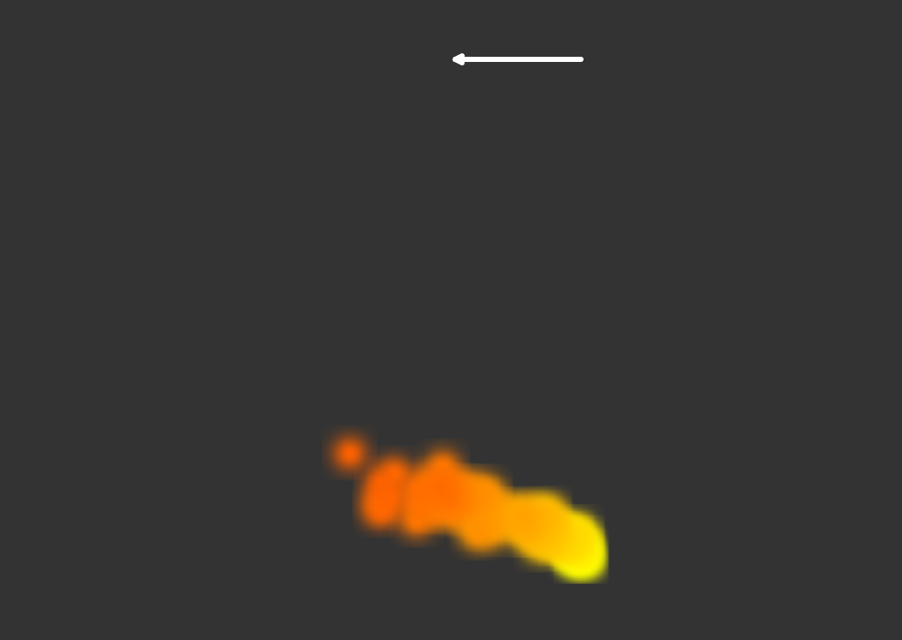
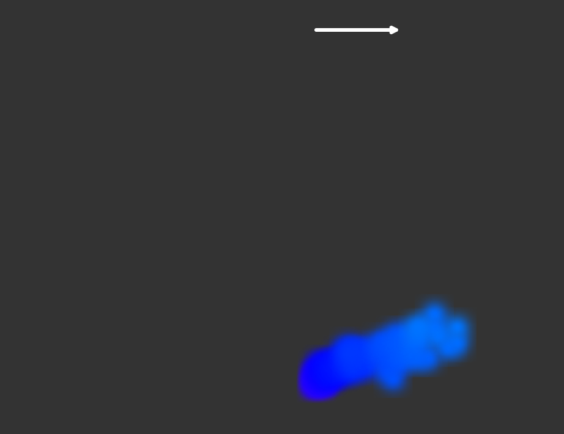
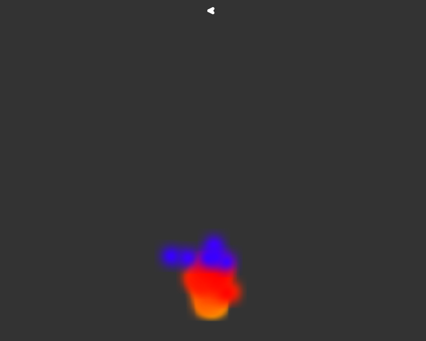

# Quiz 8

## Part 1: Imaging Technique Inspiration

This smoke particle system demo uses p5.Vector and createVector() to update particles’ motion. The interaction follows the mouse, making users feel involved. What inspires me most is using color for interaction. In my final project, I plan to use direction to color, such as warm colors when moving left and cool colors when moving right.

### Images

### Source

[Smoke Particle System Example](https://p5js.org/examples/math-and-physics-smoke-particle-system/)

---

## Part 2: Coding Technique Exploration

This coding technique uses p5.Vector to control particle motion through forces. The map() function converts mouseX into a directional wind vector, enabling interactive control of movement. Color is generated using HSB values, which allows flexible mapping between interaction and color. As shown in image3, when the mouse is near the center, the effect is subtle and lacks a sense of engagement. In my final project, I will map both mouseX and mouseY to control direction, allowing movement in any direction.

### Image

### Example Code

[Smoke Particle System Code](https://p5js.org/examples/math-and-physics-smoke-particle-system/)